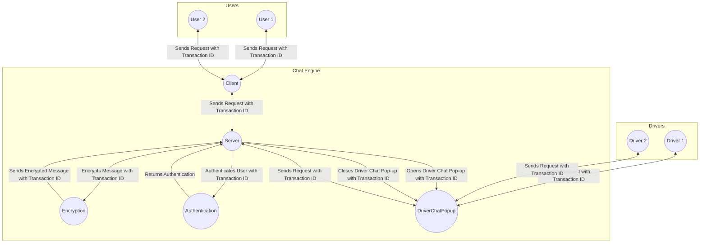

```mermaid
graph TD
subgraph Users
    A((User 1))
    B((User 2))
end

subgraph Drivers
    C((Driver 1))
    D((Driver 2))
end

subgraph Chat Engine
    E((Client))
    F((Server))
    G((Encryption))
    H((Authentication))
    I((DriverChatPopup))

    A <-->|Sends Request with Transaction ID| E
    B <-->|Sends Request with Transaction ID| E
    C <-->|Sends Request with Transaction ID| I
    D <-->|Sends Request with Transaction ID| I

    E <-->|Sends Request with Transaction ID| F
    I <-->|Sends Request with Transaction ID| F

    F -->|Authenticates User with Transaction ID| H
    H -->|Returns Authentication| F
    F -->|Encrypts Message with Transaction ID| G
    G -->|Sends Encrypted Message with Transaction ID| F
    F -->|Opens Driver Chat Pop-up with Transaction ID| I
    F -->|Closes Driver Chat Pop-up with Transaction ID| I
end
```