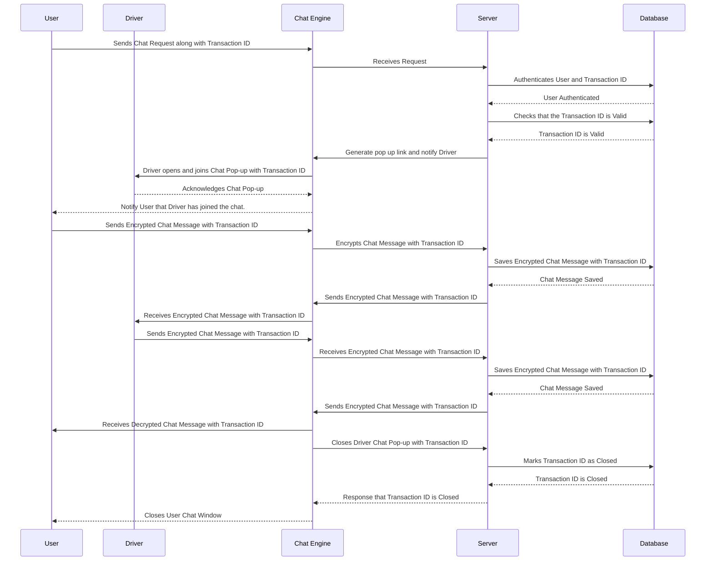

```mermaid
sequenceDiagram

participant User

participant Driver

participant Chat Engine

participant Server

participant Database

  

User->>Chat Engine: Sends Chat Request along with Transaction ID

Chat Engine->>Server: Receives Request

Server->>Database: Authenticates User and Transaction ID

Database-->>Server: User Authenticated

Server->>Database: Checks that the Transaction ID is Valid

Database-->>Server: Transaction ID is Valid

Server->>Chat Engine: Generate pop up link and notify Driver

Chat Engine->>Driver: Driver opens and joins Chat Pop-up with Transaction ID

Driver-->>Chat Engine: Acknowledges Chat Pop-up

Chat Engine-->>User: Notify User that Driver has joined the chat.

User->>Chat Engine: Sends Encrypted Chat Message with Transaction ID

Chat Engine->>Server: Encrypts Chat Message with Transaction ID

Server->>Database: Saves Encrypted Chat Message with Transaction ID

Database-->>Server: Chat Message Saved

Server->>Chat Engine: Sends Encrypted Chat Message with Transaction ID

Chat Engine->>Driver: Receives Encrypted Chat Message with Transaction ID

Driver->>Chat Engine: Sends Encrypted Chat Message with Transaction ID

Chat Engine->>Server: Receives Encrypted Chat Message with Transaction ID

Server->>Database: Saves Encrypted Chat Message with Transaction ID

Database-->>Server: Chat Message Saved

Server->>Chat Engine: Sends Encrypted Chat Message with Transaction ID

Chat Engine->>User: Receives Decrypted Chat Message with Transaction ID

Chat Engine->>Server: Closes Driver Chat Pop-up with Transaction ID

Server->>Database: Marks Transaction ID as Closed

Database-->>Server: Transaction ID is Closed

Server -->>Chat Engine: Response that Transaction ID is Closed

Chat Engine-->>User: Closes User Chat Window
```